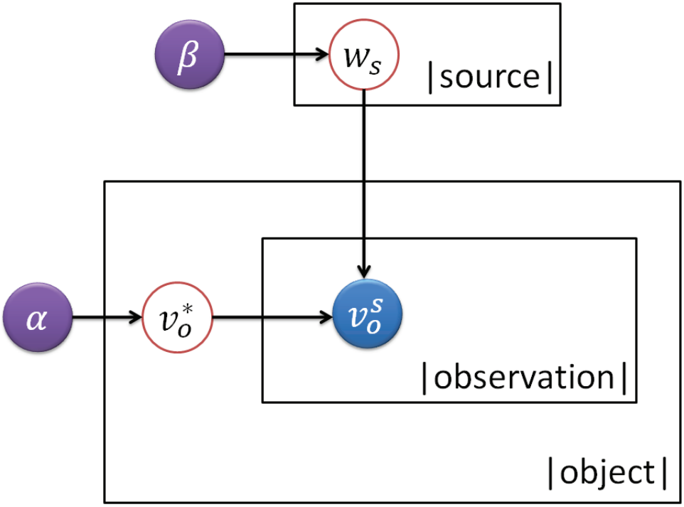

# 真值验证实验指南


## 任务引入

随着信息爆炸时代的到来，大规模知识驱动的人工智能应用衍生并发展。数据的获取已不再是困扰我们的问题，我们可以从Web网页、社交媒体平台和众包系统等众多不同的数据源中获取数据。然而，不同的数据源对于同一个问题可能给出不同的答案，数据的真实性已经成为一个值得关注重视的问题。数据的真实性可以从以下不同的角度考量：

- 精准。针对数值类型的数据，一个很大范围内的答案可能都不能算作错误。譬如喜马拉雅山的高度，说是八千多米或者万米以下都没有错误，但是显然8848米是更加精准的回答。
- 实时。数据是多变的，随着时间发展，同一个问题的答案可能会不断变化。譬如美国总统这样的事实就是随着一届届大选而变更的。
- 可信。可信这一维度将数据和提供数据的数据源链接了起来。提供同样信息的数据源可能是出于不同的动机。


## 定义

### 基本假设

如果一个数据源频繁给出可信信息，该数据源应当被分配较高的权重。

如果一条数据被许多高权重数据源支撑，那么这条数据更有可能被选择作为真值。

### 形式化术语

|     术语      |          定义           |
| :-----------: | :---------------------: |
|    object     |    感兴趣的目标问题     |
|    source     |         数据源          |
|     value     |         预测值          |
|  observation  | (source, object, value) |
|     truth     |          真值           |
| source weight |       数据源权重        |

### 问题定义

给定目标问题集合O，相关的答案预测值由数据源集合S给出。我们的目的是解决每一个目标问题$o\in O$所对应的预测值$v^s_o\in S$中存在的冲突，找出目标问题的真值$v^*_o$。与此同时，要求模型输出表征数据源可信度的权重$w_s\in S$。


## 方法

依据定义部分给出的基本假设，根据建模该假设的方法不同以及是否使用监督数据，可以将解决真值验证问题的方法大致分为以下四类：

- 基于迭代的方法。迭代地计算数据源权重和预测值置信度直至收敛。

- 基于优化的方法。通过最小化表征预测值和真值之间距离的目标式来得出最终输出。

  $$argmin_{{w_s},{v^*_o}}\sum_{o\in O}\sum_{s\in S}w_s\cdot d(v^s_o,v^*_o)$$

- 基于概率图模型的方法。将预测值试做特定随机分布基于$w_s$和$v^*_o$两个参数之下的观测值。

  

- 监督或半监督的机器学习方法。结合少量带标签数据进行真值验证流程。

### 基线介绍

为了消解多源数据的冲突，一个直截了当的方法是在离散无序的属性上投票、在数值属性上取均值。

下面给出本次实验预先给定的文件夹结构。

```bash
truth_discovery
	├─README.md						本文档
	├─majority_voting.py			一个简单的投票算法实现
	├─result_evaluation.py			用于评估算法结果的代码
    ├─dataset
    	├─book.txt					book-author数据集
    	└─book_golden.txt			所有书籍真实的作者信息
    └─result
    	└─majority_voting.txt		投票算法生成的结果文件示例
```

示例程序`majority_voting.py`中给出了一个简单的投票算法的实现。在这个算法的实现过程中有很多细节可以完善，譬如未考虑仅有细微差别的相似预测值的合并等问题。

`result_evauation.py`中的评估算法统计了命中的和未命中的数量，考虑到某些预测值可能与真值部分相似甚至仅有细微差别，使用算法输出和`book_golden.txt`中对应的真值之间的相似度之和作为评价指标。


## 实验要求

在`dataset`文件夹中包含`book.txt`和`book_golden.txt`两个文件，分别包含实验数据和手工标注的一部分正确结果，实验评估将会基于这部分正确结果。

要求实现一个真值验证算法尝试解决该问题，或者可以尝试直接对`majority_voting`进行细节上的改进，达到优于基线方法的性能。

### 算法推荐

- 迭代方法

  [TruthFinder](https://ieeexplore.ieee.org/document/4415269)

  [PooledInvestment](https://www.aclweb.org/anthology/C10-1099.pdf)

- 优化方法

  [CRH](http://dl.acm.org/citation.cfm?doid=2588555.2610509)

- 概率图方法

  [LCA](http://dl.acm.org/citation.cfm?doid=2488388.2488476)

### 推荐阅读

​	[A Survey on Truth Discovery](https://arxiv.org/abs/1505.02463)

​	[Similarity Measures](https://hpi.de/fileadmin/user_upload/fachgebiete/naumann/folien/SS13/DPDC/DPDC_12_Similarity.pdf)
